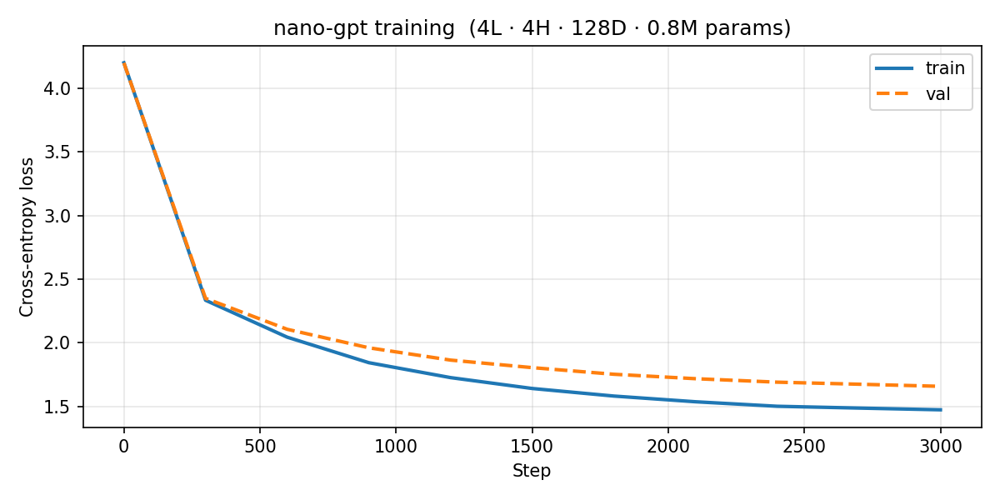
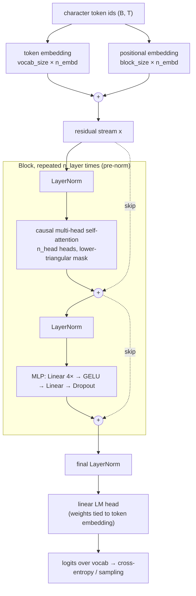

# nano-gpt

A miniature GPT language model built from scratch in PyTorch, following Karpathy's [nanoGPT](https://github.com/karpathy/nanoGPT).  
Trains character-level on Tiny Shakespeare and generates Shakespeare-flavoured text.

```
step     0/3000 │ train 4.1999 │ val 4.1989
step   300/3000 │ train 2.3350 │ val 2.3499
step  1500/3000 │ train 1.6420 │ val 1.8057
step  3000/3000 │ train 1.4746 │ val 1.6589   ✓ 97 s on Apple MPS
```



The model is trained with next-token cross-entropy loss (`F.cross_entropy` in
`model.py`), averaged over every position in every sequence in the batch:

$$\mathcal{L} = -\frac{1}{T}\sum_{t=1}^{T} \log p_\theta\!\left(x_{t+1} \mid x_{\le t}\right)$$

The `train`/`val` numbers above and in the plot are this loss (nats, base $e$), not
perplexity.

---

## Quick start

```bash
pip install -r requirements.txt
python train.py          # downloads corpus, trains, saves checkpoint + loss curve
python generate.py       # generate 500 chars from a newline prompt
python generate.py --prompt "To be or not to be" --max_new_tokens 300
```

---

## Architecture



The training run shown above uses the smaller configuration in `train.py` (4 layers, 4 heads,
`n_embd` 128, context 128); the `GPTConfig` defaults are listed under Configuration.

---

## Architectural components

### 1. Token & positional embeddings

Every integer token ID is mapped to a learned `n_embd`-dimensional vector by `nn.Embedding(vocab_size, n_embd)`.  
Because the self-attention operation is permutation-invariant, the model has no idea *where* a token sits in the sequence unless we tell it.  
A second learned embedding table `nn.Embedding(block_size, n_embd)` maps each absolute position (0 … T-1) to a vector and adds it to the token embedding, giving the model positional awareness.

Both tables are initialised with `N(0, 0.02)`, small enough that the initial logits are near-uniform.

---

### 2. Causal (masked) multi-head self-attention

Self-attention lets every position gather information from every other position in a single matrix multiply.  
Three linear projections produce **queries** $Q$, **keys** $K$, and **values** $V$ from the input, all packed into one weight matrix for efficiency:

$$\mathrm{Attention}(Q, K, V) = \mathrm{softmax}\!\left(\frac{QK^\top}{\sqrt{d_{head}}}\right) V$$

$\sqrt{d_{head}}$ keeps the dot-product variance stable regardless of head size.

**Multi-head** attention splits the embedding into `n_head` independent subspaces, runs attention in each, then concatenates and projects back.  
Each head can specialise in a different relationship (syntax, coreference, position, …).

**Causal mask**: a lower-triangular matrix of ones is stored as a buffer and used to set future positions to −∞ before the softmax.  
This means position *t* can only attend to positions ≤ t: essential for autoregressive language modelling.

---

### 3. Feed-forward network (MLP)

After attention mixes information across positions, the MLP processes each position *independently*:

```
x → Linear(n_embd → 4·n_embd) → GELU → Linear(4·n_embd → n_embd) → Dropout
```

The 4× expansion gives the model extra capacity to learn nonlinear transformations.  
GELU (Gaussian Error Linear Unit) is used instead of ReLU: it has a smooth gradient near zero, which empirically helps transformers converge.

---

### 4. Transformer block with residual connections

Each block wraps attention and MLP in two **residual** (skip) connections:

```python
x = x + attn(layernorm(x))   # attention sub-layer
x = x + mlp(layernorm(x))    # MLP sub-layer
```

Residual connections allow gradients to flow directly from the loss back to early layers, avoiding vanishing gradients.  
The **pre-norm** arrangement (normalise before, not after) is more stable than the original "post-norm" from *Attention Is All You Need*.

---

### 5. Layer normalisation

`nn.LayerNorm` normalises each token's feature vector to zero mean and unit variance, then applies learned per-feature scale (γ) and shift (β).  
Unlike batch normalisation, LayerNorm operates over the feature dimension so its statistics are independent of batch size and sequence length, important for variable-length sequences.

---

### 6. Weight tying

The token-embedding matrix `wte` (shape `vocab_size × n_embd`) and the final linear projection `lm_head` (shape `n_embd × vocab_size`) are **shared**:

```python
self.transformer["wte"].weight = self.lm_head.weight
```

This halves the parameter count for the vocabulary matrices, regularises training (the same vector that represents a token as input must also distinguish it as output), and was shown in [Press & Wolf 2017](https://arxiv.org/abs/1608.05859) to improve perplexity.

---

### 7. Residual stream scaling

Residual projections (`c_proj`) are initialised with a smaller standard deviation, $0.02 / \sqrt{2 \cdot n_{layer}}$, so that at initialisation the variance of the residual stream stays roughly constant with depth, rather than growing with every layer added.

---

### 8. Text generation (`generate()`)

```python
model.generate(idx, max_new_tokens=500, temperature=0.8, top_k=40)
```

Autoregressive decoding: feed the current context, take the logit for the **last** position, sample the next token, append it, repeat.

* **Temperature** divides the logits before softmax: `< 1` sharpens the distribution (more deterministic), `> 1` flattens it (more random).
* **Top-k** restricts sampling to the k highest-probability tokens by setting all other logits to −∞, preventing the model from hallucinating very unlikely tokens.

---

## Configuration

All architecture knobs live in `GPTConfig`:

| Field        | Default | Meaning                         |
|--------------|---------|---------------------------------|
| `block_size` | 256     | maximum context length          |
| `vocab_size` | 65      | character vocabulary size       |
| `n_layer`    | 6       | transformer blocks stacked      |
| `n_head`     | 6       | attention heads per block       |
| `n_embd`     | 384     | embedding dimension             |
| `dropout`    | 0.2     | dropout probability             |
| `bias`       | True    | bias terms in Linear layers     |

Default training config in `train.py` is smaller (128-dim, 4 layers) for a ~2-minute run.  
Swap in the commented-out full config for better quality.

---

## File structure

```
nano-gpt/
├── model.py        : GPTConfig, CausalSelfAttention, MLP, Block, GPT
├── train.py        : data loading, training loop, cosine LR, loss plot
├── generate.py     : load checkpoint and sample text
├── loss_curve.png  : training / validation loss (generated after train.py)
├── requirements.txt
└── README.md
```

---

## References

- Radford et al., *Language Models are Unsupervised Multitask Learners* (GPT-2), 2019  
- Vaswani et al., *Attention Is All You Need*, 2017  
- Karpathy, [nanoGPT](https://github.com/karpathy/nanoGPT)  
- Karpathy, [Let's build GPT](https://youtu.be/kCc8FmEb1nY) (YouTube)
